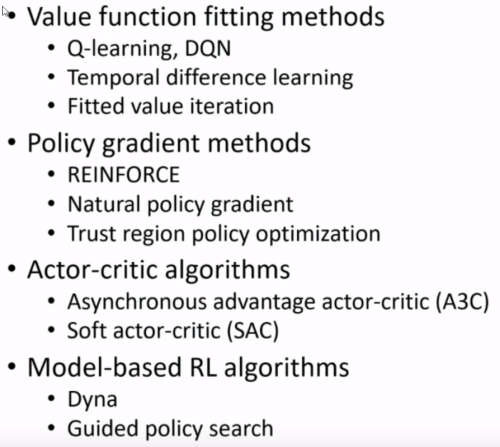

# [@](./README.md) Lecture 4: Introduction to Reinforcement Learning

**Today**: high-level overview of RL methods.

1. Definition of a MDP
2. Definition of RL problem
3. Anatomy of a RL algorithm
4. Brief overview of RL algorithm types

## 1. Definitions

### Terminology and notation

**Remark**: some RL methods do handle partial observability, some others do not.

**Remark**: you cannot just take the greedy action wrt to the reward, you have to think about what will be the rewards in the future.

### Markov chain

- $\mathcal{S}$ - state space
- $\mathcal{T}$ - transition operator

>Transition "operator" since it is a linear operator that apply to vector of probabilities $\mu$: 
>
>- $\mu_{t,i} = p(s_t = i)$ - $\mu_t$ is a vector of probabilites, summing to 1.
>- $\mathcal{T}_{i,j} = p(s_{t+1} = i | s_t = j)$
>
>Then $\mu_{t+1} = \mathcal{T}\mu_t$.

Markov property: $p(s_{t+1} | s_t)$ is independent of $s_{t-1}$.

### Markov Decision Process

MDP: $\mathcal{M} = \{\mathcal{S}, \mathcal{A}, \mathcal{T}, r\}$ 

with:

- $\mathcal{S}$ - state space
- $\mathcal{A}$ - action space
- $\mathcal{T}$ - transition operator (now a tensor)

>- $\mu_{t,j} = p(s_t = j)$ 
>- $\xi_{t,k} = p(a_t = k)$ 
>- $\mathcal{T}_{i,j,k} = p(s_{t+1} = i | s_t = j, a_t = k)$
>
>Then $\mu_{t+1, i} = \sum_{j,k} \mathcal{T}_{i,j,k}\mu_{t,j}\xi_{t,k}$.

- $r$ - reward function $r(s_t, a_t)$.

### Partially Observed MDP

POMDP: $\mathcal{M} = \{\mathcal{S}, \mathcal{A}, \mathcal{O}, \mathcal{T}, \mathcal{E}, r\}$ 

with:

- $\mathcal{S}$ - state space
- $\mathcal{A}$ - action space
- $\mathcal{O}$ - observation space
- $\mathcal{T}$ - transition operator (like before)
- $\mathcal{E}$ - emission probability $p(o_t | s_t)$.
- $r$ - reward function.

Note that observations are independent given the states.

## 2. The reinforcement learning problem

### The goal of reinforcement learning

Produce a policy $\pi_\theta(a | s)$ (let's come back to POMDP later).

Probability of a trajectory, using the graphical model: 

$p_\theta(\tau) = p_\theta(s_1, a_1, ..., s_T, a_T) = p(s_1) \prod_{t=1}^T \pi_\theta(a_t | s_t) p(s_{t+1} | s_t, a_t)$

Optimization problem (expected reward): 

$\theta^* = \mathrm{arg}\max_{\theta} \mathbb{E}_{\tau \sim p_\theta(\tau)} \big[ \sum_t r(s_t, a_t) \big]$

### MDP to Markov chain

Given a policy $\pi_\theta$, we can turn our MDP into a Markov *chain* by grouping states and actions together:

$(a_1, s_1) \rightarrow (a_2, s_2) \rightarrow (a_3, s_3) \rightarrow ...$

The transition probability of this Markov chain is:

$p\big( (s_{t+1}, a_{t+1}) | (s_t, a_t) \big) = p(s_{t+1} | s_t, a_t) \pi_\theta(a_{t+1} | s_{t+1})$

We can write our optimization objective using the *state-action* marginal $p_\theta(s_t, a_t)$:

$\theta^* = \mathrm{arg}\max_{\theta} \sum_{t=1}^T \mathbb{E}_{(s_t, a_t) \sim p_\theta(s_t, a_t)} \big[ r(s_t, a_t) \big]$

### Infinite horizon: stationary distribution thanks to ergodicity

We divide our optimization objective by $T$, so as we may obtain something *finite* when $T$ goes to infinity: 

$\theta^* = \mathrm{arg}\max_{\theta} \frac{1}{T} \sum_{t=1}^T \mathbb{E}_{(s_t, a_t) \sim p_\theta(s_t, a_t)} \big[ r(s_t, a_t) \big]$

Under **ergodicity** assumption (roughly speaking, every $s,a$ is reachable from every $s,a$ with non-zero probability),
 $p(s_t, a_t)$ converges to a *stationary* distribution $p(s,a)$.
 
This means that our optimization problem becomes, in the limite $T \rightarrow \infty$:

$\theta^* = \mathrm{arg}\max_{\theta} \mathbb{E}_{(s, a) \sim p_\theta(s, a)} \big[ r(s, a) \big]$

### Expectations

In RL, we often we deal with **expected** reward. 

In particular, even if the reward is not smooth, its expectation with respect to the trajectories of a policy can be smooth in $\theta$. 

Note that we can explicit our expecations over trajectories (using Markov property):

$\mathbb{E}_{ \tau \sim p_\theta(\tau)} \Big[ \sum_{t=1}^T r(s_t, a_t) \Big] = \mathbb{E}_{s_1 \sim p(s_1)} \Big[ \mathbb{E}_{a_1 \sim \pi_\theta(s_1) } \big[ r(s_1, a_1) + \mathbb{E}_{s_2 \sim p(s_2 | s_1, a_1) } [ \mathbb{E}_{a_2 \sim \pi_\theta(a_2 | s_2)} [ r(s_2, a_2) + ... | s_2 ] | s_1, a_1 ]  | s_1 \big] \Big]$ 

## 3. Anatomy of a reinforcement learning algorithm

Each block can be trivial or expensive, depending of the situation.

### Q-function 

Q for quality. 

$Q^\pi(s_t, a_t)$ is the total expected reward from taking $a_t$ in $s_t$.

$Q^\pi(s_t, a_t) = \sum_{t' = t}^T \mathbb{E}_{\pi_\theta} \big[ r(s_{t'}, a_{t'} ) | s_t, a_t \big]$

In RL, we will try to estimate this quantity.

Value function: $V^\pi(s_t) = \mathbb{E}_{a_t \sim \pi_\theta(a_t | s_t)} \big[ Q^\pi(s_t, a_t) \big]$

### Using Q function 

Idea 1 (q-learning like): if we have a policy $\pi$ and we know $Q^\pi(s,a)$, then we can *improve* $\pi$, by choosing actions with high q-value. 

Idea 2 (actor-critic like): compute gradient wrt $a$ to increase probability of good actions $a$. A good action is such that $Q^\pi(s, a) \gt V^\pi(s)$.

### Types of RL algorithms

+ Policy gradients: directly differentiate wrt $\theta$ the objective (expected total reward).
+ Value-based: estimate V or Q of the optimal policy (no explicit policy).
+ Actor-critic: estimate V or Q of the current policy, use it to improve the policy (kind of combination of the first two).
+ Model-based RL: estimate the transition model...
	- Use it for planning
	- Use it to improve a policy
	- Something else
	
	
### Tradeoffs (why so many RL algorithms?)

- Different tradeoffs
	- Sample efficiency (off policy?)
	- Stability and ease of use 
- Different assumptions 
	- Full observability?
	- Stochastic or deterministic?
	- Continuous or discrete?
	- Episodic or infinite horizon?
- Different things are easy or hard in different settings
	- Easier to represent the policy? 
	- Easier to represent the model? 

	
### Examples

