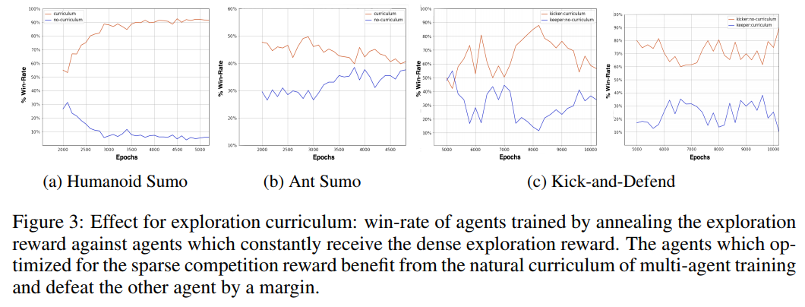

# Emergent Complexity via Multi-Agent Competition
#### Bansal, Pachocki, Sidor, Stskever, Mordach (2018)

In this work, the authors create 4 different competition environments (*Run to goal*, *You shall not pass*, *Sumo*, *Kiand and defend*), to train an agent using adversarial learning. Their main contribution is the sharing of 4 important tricks that are especially important in a competition setting.

**Main statement :** Show that comptetitive multi-agent training provides a *natural curriculum* during learning (opponent is always the right strength) which allows agents to learn complex behaviors.

### Training details

* Algorithm used : Proximal Policy Optimization (PPO) (Schulman et al., 2017)
* Use really large batch_size (5120) : Helps reduce gradient variance and increase exploration
* Use LSTM for some environemnts (truncated BPTT over 100 steps)
* Found L2-regularization helpful

### Tricks

1. **Handcrafted Dense Reward** (with annealing curriculum)
	* Kick-start the agent (help gim learn basic concepts like standing up, walking) by using a dense reward function that 
2. **Oponent sampling**
	* Training agent against the most recent opponent leads to imbalance. Instead, for each rollout, they sample old parameters for the opponent's policy. (for self-play, this ensures continual learning)
3. **World randomization** (with low-to-high curriculum)
	* Introduce randomness in the environment's properties (dimensions, spawning points, etc.). Leads to more robust policies.
4. **Random policy initialization from an ensemble**
	* The idea is to learn multiple policies (different random seeds) and at the beginning of each rollout, sample the opponent's policy among one the learned policy. Allows to avoid self-consistent behavior where an agent overfits it's opponent instead of learning a truly robust policy.

