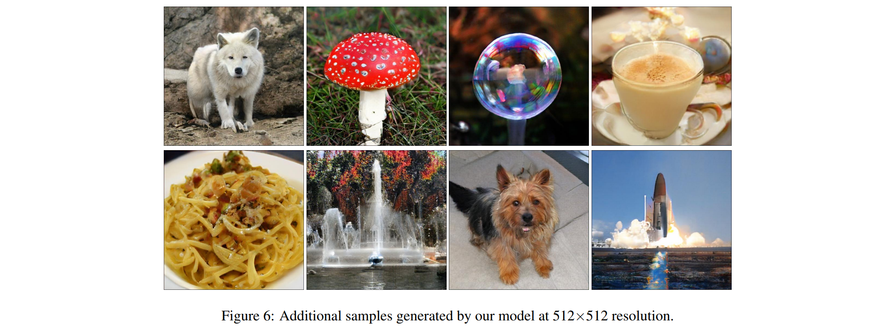
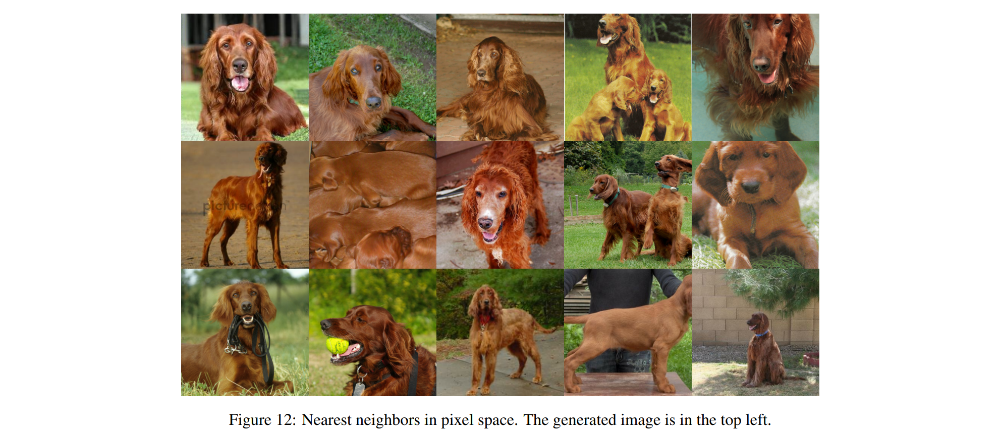
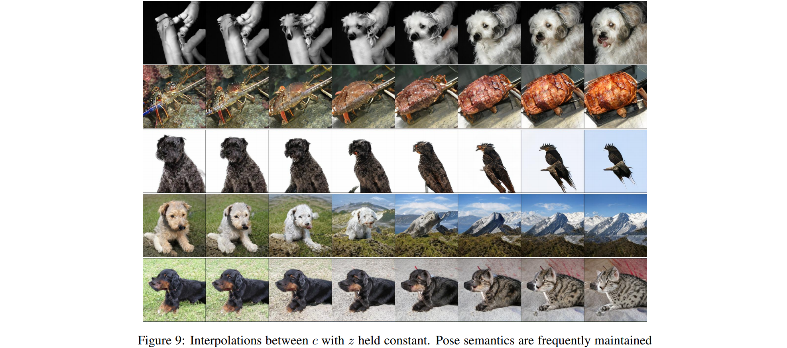
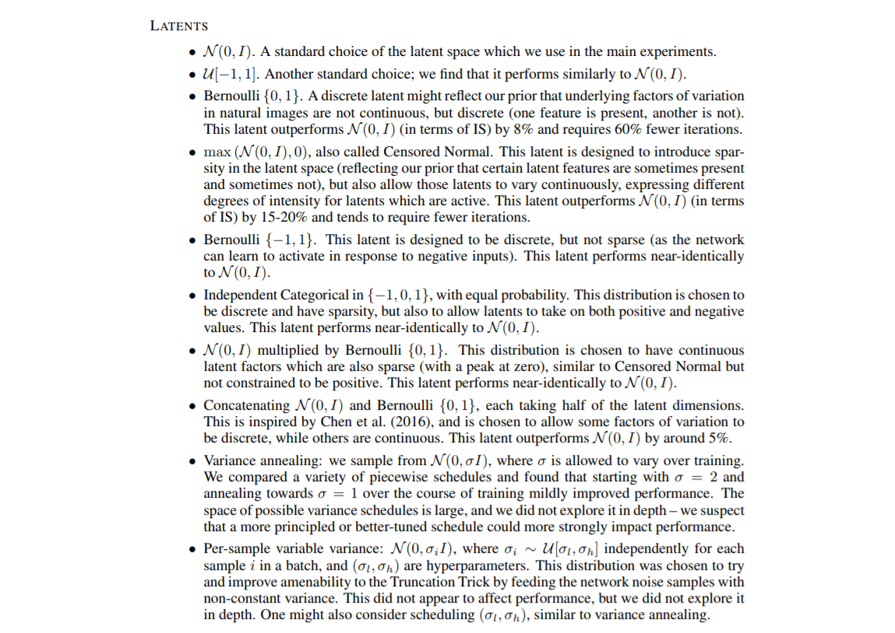

# Large Scale GAN Training for High Fidelity Natural Image Synthesis
#### Anonymous (paper under double-blind review) (2019)

In this work, the authors successfully train bigger GANs than what is usually used (in terms of number of parameters and batch sizes), allowing their models to generate stunningly realistic, high resolution images conditionned on classes from ImageNet. They reach a final IS/FID scores of 166.3/9.6 which represents a net improvement over previous state of the art.

### Main tricks

* **GANs benefit dramatically from scaling:** Increasing the batch size and number of channels alone allowed to improve from 52 to 92 in Inception Score (IS) and a reduction from .
* **Shared embeddings:** Use the same class-embedding to compute each layer's conditional BatchNorm gains and biases. Reduces computation and memory cost and improves training speed.
* **Hierarchical latent spaces:** Consists of splitting the noise vector (latent variables) into chunks and feeding them in multiple layers of the generator (G) instead of just the first one. Allowed to reduce comutation cost, improve training speed and small performance  improvement.
* **Truncation trick:** They train their models by sampling the noise vector *z* from a multi-dimensional normal distribution, but surprisingly obtain better results when sampling *z*, at test time, from a truncated normal distribution (values which fall outside of a pre-defined range are resampled to fall inside that range. Interestingly, they notice that as the threshold is reduced (and elements of *z* are closer to zero), the quality of the generated images increases but their variety decreases. The truncation trick therefore allows a fine-grained control over the tradeoff quality/variety of samples from the generator.
* **Orthogonal regularization:** The distributional shift between the prior used for training and the truncated one used for testing creates artefacts in the generated images of some larger models. They try to enforce *amenability to truncation* by conditioning G to be smoother, which has the effect to make the whole latent space map to natural-like output samples (and therefore allow truncation at test-time). They use orthogonal regularization for that purpose (enforce the orthogonality condition).
* **Early stopping to prevent mode collapse:** They noted that first and second singular values tend to explode for the generator and jump for the discriminator when the model collapses. However, constraining singular values of either G or D was to enough to stabilise the training and maintain quality, which is why they still recommend early stopping to avoid mode collapse.

### Results

### Latent Prior Distribution

The authors also question the mainstream use of Normal and Uniform distribution as prior for the latent variables, and give an interesting list pf alternative prior distributions in the appendix:

